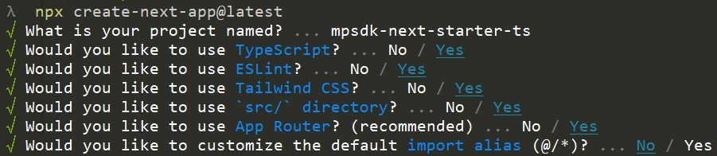

# Matterport SDK Next.js Starter

This is an attempt to create a Next.js starter that shows how to integrate both the [Matterport WebComponent](https://www.npmjs.com/package/@matterport/webcomponent) and [@matterport/sdk](https://www.npmjs.com/package/@matterport/sdk).

The WebComponent is loaded dynamically as our NPM Package is not compatible with server side rendering.

Upon installing, the latest version of our matterport-assets will automatically run - this is helpful for use within code sandbox environments.

## Base Next.js project
The Base Next.js project is a [Next.js](https://nextjs.org/) project bootstrapped with [`create-next-app`](https://github.com/vercel/next.js/tree/canary/packages/create-next-app).



### Environment Variables

Rename `.env.local.demo` file to `.env.local` and set these variables:
 - `NEXT_PUBLIC_MODEL_ID`
 - `NEXT_PUBLIC_APP_KEY`

### Install

```bash
yarn install
```

### Run

```bash
yarn dev
```

Open [http://localhost:3081](http://localhost:3081) with your browser to see the result.

[](https://stackblitz.com/github/ItsChrisHickman/mpsdk-next-starter)

The file: .babelrc is included to disable SWC so that this example can be experienced on
Stackblitz without SWC.  SWC is much faster than Babel, therefore, it is recommended that
you disable this file.  [Read More](https://nextjs.org/docs/messages/failed-loading-swc)

Last updated Apr 3, 2024
